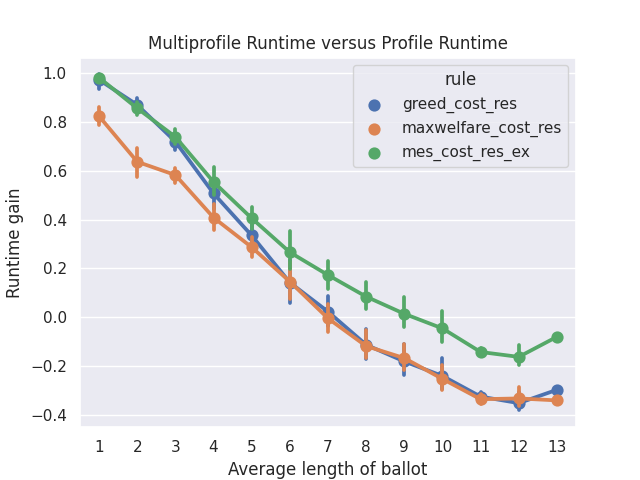

Complete Guide
==============

This is a more complete guide on how to use Pabutools. For a more basic tutorial,
check the :ref:`quickstart` page.

Instances
---------

For reference, see the module :py:mod:`~pabutools.election.instance`.

A participatory budgeting instance describes all the elements that define the elections. It includes the
projects that are being voted on, together with the budget limit.

The main class here is :py:class:`~pabutools.election.instance.Instance`.
This class inherits from the Python class `set` and behaves as a set of projects,
with additional information. Projects are instantiations of the class
:py:class:`~pabutools.election.instance.Project`, which stores a project's name and cost
(and potential additional information). Let's see an example.

.. code-block:: python

    from pabutools.election import Instance, Project

    instance = Instance()   # There are many optional parameters
    p1 = Project("p1", 1)   # The constructor takes the name and cost of the project
    instance.add(p1)   # Use the set methods to add/delete projects to an instance
    p2 = Project("p2", 1)
    instance.add(p2)
    p3 = Project("p3", 3)
    instance.add(p3)

Importantly, any Python comparison between two projects (equality, etc...) is done based on the
name of the projects. Since an instance is a set, adding a project `Project("p", 1)` and
another project `Project("p", 3)` will lead to an instance with a single project.

An instance also stores additional information such as the budget limit of the election
and additional metadata.

.. code-block:: python

    instance.budget_limit = 3   # The budget limit
    instance.meta   # dict storing metadata on the instance
    instance.project_meta   # dict of (project, dict) storing metadata on the projects

Several methods can be called on an instance to run through all the budget allocations,
test the feasibility of a set of projects, etc...

.. code-block:: python

    for b in instance.budget_allocations():
        print(str(b) + " is a feasible budget allocation")
    instance.is_feasible([p1, p2, p3])   # Returns False
    instance.is_exhaustive([p1, p2])   # Returns True

Profiles
--------

For reference, see the modules :py:mod:`~pabutools.election.ballot` and
:py:mod:`~pabutools.election.profile`.

A profile is the second basic component of a participatory budgeting election; it stores
the ballots of the voters.

We provide one general class :py:class:`~pabutools.election.profile.profile.Profile`
that inherits from the Python class `list` and is inherited from by all specific
profile types. It is really meant to be an abstract class and should not be used
for any other purpose than inheritance. Similarly, we provide a class
:py:class:`~pabutools.election.ballot.ballot.Ballot` that will be inherited by specific
ballot formats.

A profile is linked to an instance, which is given as a parameter and then stored in
an attribute. It also implements validation of the ballots to ensure consistency
of the ballots in a profile.

.. code-block:: python

    from pabutools.election import Instance, Profile, Ballot

    instance = Instance()
    profile = Profile(instance=instance)
    profile.ballot_validation = True   # Boolean (de)activating the validation of the ballot type
    profile.ballot_type = Ballot   # The type used for the ballot validation
    b = {1, 2, 3}
    profile.validate_ballot(b)   # The validator, would raise a TypeError here

Approval Profiles
^^^^^^^^^^^^^^^^^

When submitting approval ballots, voters submit a set of projects they approve of.
Approval ballots are represented through the class
:py:class:`~pabutools.election.ballot.approvalballot.ApprovalBallot` that inherits
both from `set` and from :py:class:`~pabutools.election.ballot.ballot.Ballot`.

A profile of approval ballots, i.e., an approval profile, is instantiated from the class
:py:class:`~pabutools.election.profile.approvalprofile.ApprovalProfile`. It inherits from
:py:class:`~pabutools.election.profile.profile.Profile`. The type for the ballot
validator is by default set to
:py:class:`~pabutools.election.ballot.approvalballot.ApprovalBallot`.

.. code-block:: python

    from pabutools.election import Project, ApprovalBallot, ApprovalProfile

    p = [Project("p{}".format(i), 1) for i in range(10)]
    b1 = ApprovalBallot(p[:3])   # Approval ballot containing the first 3 projects
    b1.add(p[4])   # Add project to approval ballot
    b2 = ApprovalBallot(p[1:5])
    profile = ApprovalProfile([b1, b2])
    b3 = ApprovalBallot({p[0], p[8]})
    profile.append(b3)
    b1 in profile   # Tests membership, returns True here

Several additional methods are provided in the ApprovalProfile class.

.. code-block:: python

    profile.approval_score(p1)   # The approval score of a project, i.e., the number of approvers
    profile.is_party_list()   # Boolean indicating if the profile is party_list

Cardinal Profiles
^^^^^^^^^^^^^^^^^

When asked for cardinal ballots, voters are asked to associate each project with a score.
Cardinal ballots are represented using the class
:py:class:`~pabutools.election.ballot.cardinalballot.CardinalBallot`.
It inherits directly from the Python `dict` class and our
:py:class:`~pabutools.election.ballot.ballot.Ballot` class.

A profile of cardinal ballots, i.e., a cardinal profile, is instantiated through the
:py:class:`~pabutools.election.profile.cardinalprofile.CardinalProfile` class.
It inherits from the :py:class:`~pabutools.election.profile.profile.Profile` class and validates ballot types using
:py:class:`~pabutools.election.ballot.cardinalballot.CardinalBallot`.

.. code-block:: python

    from pabutools.election import Project, CardinalBallot, CardinalProfile

    p = [Project("p{}".format(i), 1) for i in range(10)]
    b1 = CardinalBallot({p[1]: 5, p[2]: 0})   # Cardinal ballot scoring 5 for p1 and 0 for p2
    b1.append(p[1])   # The ballot becomes p0 > p4 > p2 > p1
    profile = CardinalProfile()
    profile.append(b1)

Cumulative Profiles
^^^^^^^^^^^^^^^^^^^

Cumulative ballots correspond to a specific type of cardinal ballots where the voters are
allocated a specific number of points that they can distribute among the projects.
The class :py:class:`~pabutools.election.ballot.cumulativeballot.CumulativeBallot`
is used to deal with cumulative ballots. It inherits from
:py:class:`~pabutools.election.ballot.cardinalballot.CardinalBallot` and thus also from
the Python class `dict`.

As before, a profile of cumulative ballots is defined in the class
:py:class:`~pabutools.election.profile.cumulativeprofile.CumulativeProfile`
that inherits from the :py:class:`~pabutools.election.profile.profile.Profile` class
(and acts thus as a `list`).

Ordinal Profiles
^^^^^^^^^^^^^^^^

When ordinal ballots are used, voters are asked to order the projects based on their
preferences. The class :py:class:`~pabutools.election.ballot.ordinalballot.OrdinalBallot`
represents such ballots. It inherits from the Python class `list` and our class
:py:class:`~pabutools.election.ballot.ballot.Ballot`.

Ordinal profiles are handled by the class
:py:class:`~pabutools.election.profile.ordinalprofile.OrdinalProfile`.

.. code-block:: python

    from pabutools.election import Project, OrdinalBallot, OrdinalProfile

    p = [Project("p{}".format(i), 1) for i in range(10)]
    b1 = OrdinalBallot((p[0], p[4], p[2]))   # Ordinal ballot ranking p0 > p4 > p2
    b1.append(p[1])   # The ballot becomes p0 > p4 > p2 > p1
    profile = OrdinalProfile()
    profile.append(b1)

Multiprofile
-------------

For reference, see the modules :py:mod:`~pabutools.election.profile`.

In some cases, it is faster to use multisets instead of lists for the profiles. We have
implemented this through multiprofiles. A multiprofile is a collection of ballots in which
each ballot is stored once, together with its multiplicity. Importantly, we always our
implementations always allow for profiles and multiprofiles to be used interchangeably.

Multiprofiles are defined through the class
:py:class:`~pabutools.election.profile.profile.MultiProfile` that inherits from the Python
class `Counter`. Each specific type of profile has its multiprofile counterpart:
:py:class:`~pabutools.election.profile.approvalprofile.ApprovalMultiProfile`,
:py:class:`~pabutools.election.profile.cardinalprofile.CardinalMultiProfile`,
:py:class:`~pabutools.election.profile.cumulativeprofile.CumulativeMultiProfile`,
and :py:class:`~pabutools.election.profile.ordinalprofile.OrdinalMultiProfile`.

Since ballots are used as dictionary keys in a multiprofile, they need not be mutable.
We have thus implemented the class :py:class:`~pabutools.election.ballot.ballot.FrozenBallot`
which corresponds to the non-mutable correspondence to a ballot. All specific ballot types
have their frozen counterparts:
:py:class:`~pabutools.election.ballot.approvalballot.FrozenApprovalBallot`,
:py:class:`~pabutools.election.ballot.cardinalballot.FrozenCardinalBallot`,
:py:class:`~pabutools.election.ballot.cumulativeballot.FrozenCumulativeBallot`,
and :py:class:`~pabutools.election.ballot.ordinalballot.FrozenOrdinalBallot`.

Ballots can easily be frozen:

.. code-block:: python

    from pabutools.election import Project, ApprovalBallot, FrozenApprovalBallot

    app_ballot = ApprovalBallot({Project("p1", 1), Project("p2", 2)})
    # Freezing a ballot using the frozen method of a ballot
    frozen_ballot = app_ballot.frozen()

    # Freezing a ballot using the frozen ballot constructor
    frozen_ballot = FrozenApprovalBallot(app_ballot)

Similarly profiles can easily be turned into multiprofiles:

.. code-block:: python

    from pabutools.election import Project, ApprovalBallot, FrozenApprovalBallot
    from pabutools.election import ApprovalProfile, ApprovalMultiProfile

    b1 = ApprovalBallot({Project("p1", 1), Project("p2", 2)})
    b2 = ApprovalBallot({Project("p1", 1), Project("p3", 2)})
    profile = ApprovalProfile([b1, b2])

    # Multiprofile from the method of a profile
    multiprofile = profile.as_multiprofile()

    # Multiprofile using the constructor
    frozen_ballot = ApprovalMultiProfile(profile=profile)

What is the gain of multiprofiles, you would ask? Well, we can show that using multiprofile
speeds up the computation as long as voters do not approve of more than 7 projects on average.

For the above plot, we computed the outcome of the rules on the data hosted on
`pabulib <http://pabulib.org>`_ both when using profiles and multiprofiles. We measured the
runtime and plotted the following measure:

.. code-block:: shell

    (multiprofile_runtime - profile_runtime) / max(multiprofile_runtime, profile_runtime)

To get more insights, we also plot the actual runtime for each type of profiles:

.. image:: ../../analysis/plots/RuntimeMESCost.png
  :width: 600
  :alt: Analysis of the runtime of MES[Cost_Sat] using profiles and multiprofiles

(Note the log scale above)

Preference Libraries
--------------------

For reference, see :ref:`preflibraries`.

We provide support for standard preference libraries that are widely used.

PaBuLib
^^^^^^^

We provide full support for the participatory budgeting data hosted on the
`pabulib <http://pabulib.org>`_ website. The function
:py:func:`~pabutools.election.pabulib.parse_pabulib` can be used to parse a file
formatted according to the pabulib format. It returns the instance
and the profile, using the suitable profile class given the ballot
format in the data.

.. code-block:: python

    from pabutools.election import parse_pabulib

    instance, profile = parse_pabulib("path_to_the_file")

Pabulib files provide a whole range of metadata, not all of which is
relevant to everyone. These metadata are stored in the `meta`
members of the instance and profile classes.

.. code-block:: python

    from pabutools.election import parse_pabulib

    instance, profile = parse_pabulib("path_to_the_file")
    instance.meta   # The meta dict is populated with all the metadata described in the file
    instance.project_meta    # The project_meta dict is populated with the metadata related to the projects
    for ballot in profile:
        ballot.meta    # The meta dict populated with the metadata corresponding to the ballot

There are several metadata that are stored as members of the relevant
classes. These, for instance, include all the constraints (when known)
the voters faced when submitting their ballots. It includes the minimum
length of a ballot or the number of points that have to be distributed
for instance.

.. code-block:: python

    ### For ApprovalProfile, CardinalProfile, CumulativeProfile, and OrdinalProfile
    profile.legal_min_length   # Imposed minimum length of the ballots in the profile
    profile.legal_max_length   # Imposed maximum length of the ballots in the profile

    ### For ApprovalProfile only
    profile.legal_min_cost   # Imposed minimum total cost of the ballots in the profile
    profile.legal_max_cost   # Imposed maximum total cost of the ballots in the profile

    ### For CardinalProfile and CumulativeProfile
    profile.legal_min_score   # Imposed minimum score assigned to a project for the ballots in the profile
    profile.legal_max_score   # Imposed maximum score assigned to a project for the ballots in the profile

    ### For CumulativeProfile only
    profile.legal_min_total_score   # Imposed minimum total scores for the ballots in the profile
    profile.legal_max_total_score   # Imposed maximum total scores for the ballots in the profile

PrefLib
^^^^^^^

We also support the PrefLib format, providing functions to move save a participatory
budgeting election into a PrefLib instance.

.. code-block:: python

    from pabutools.election import Instance, ApprovalProfile, CardinalProfile, OrdinalProfile
    from pabutools.election import approval_to_preflib, cardinal_to_preflib, ordinal_to_preflib

    instance = Instance()

    # Approval profiles are mapped to categorical instances for PrefLib
    app_profile = ApprovalProfile()
    preflib_instance = approval_to_preflib(instance, app_profile)

    # Cardinal profiles are mapped to ordinal instances for PrefLib
    card_profile = CardinalProfile()
    preflib_instance = cardinal_to_preflib(instance, card_profile)

    # Ordinal profiles are mapped to ordinal instances for PrefLib
    ord_profile = ApprovalProfile()
    preflib_instance = ordinal_to_preflib(instance, ord_profile)

Satisfaction Measures
---------------------

Many concepts, including celebrated participatory budgeting rules, are not using the ballots
directly but rather proxies for the satisfaction of the voters that are deduced from the ballots.

We provide many satisfaction functions and flexible ways to create new ones.
A satisfaction function is a class that inherits from
:py:class:`~pabutools.election.satisfaction.satisfactionmeasure.SatisfactionMeasure`,
i.e., a class initialized for a given instance, profile, and ballot and
that implements a `sat` method used to compute the satisfaction. Since a satisfaction function corresponds to a single ballot,
we also provide a :py:class:`~pabutools.election.satisfaction.satisfactionprofile.SatisfactionProfile`
class. This class inherits from the Python class `list` and implements a
satisfaction profile. Note that there is also a class
:py:class:`~pabutools.election.satisfaction.satisfactionprofile.SatisfactionMultiProfile`,
implementing satisfaction profiles as multisets.

The typical workflow is thus to gather the ballots in a profile, then
convert it into a collection of satisfaction functions, which are finally
provided as input to a rule.

.. code-block:: python

    from pabutools.election import SatisfactionProfile, SatisfactionMeasure
    from pabutools.election import parse_pabulib

    instance, profile = parse_pabulib("path_to_the_file")
    sat_profile = SatisfactionProfile(instance=instance)

    # We define a satisfaction function:
    class MySatisfaction(SatisfactionMeasure):
        def sat(self, projects):
            return 100 if "p1" in projects else len(projects)

    # We populate the satisfaction profile
    for ballot in profile:
        sat_profile.append(MySatisfaction(instance, profile, ballot))

    # The satisfaction profile is ready for use
    outcome = rule(sat_profile)

Because the above can be tedious, we provide simpler ways to define the
satisfaction profile. Several widely used satisfaction functions are also
directly provided.

.. code-block:: python

    from pabutools.election import SatisfactionProfile, Cardinality_Sat
    from pabutools.election import parse_pabulib

    instance, profile = parse_pabulib("path_to_the_file")
    # If a profile and a sat_class are given to the constructor, the satisfaction profile
    # is directly initialized with one instance of the sat_class per ballot in the profile.
    sat_profile = SatisfactionProfile(instance=instance, profile=profile, sat_class=Cardinality_Sat)
    # The satisfaction profile is ready for use
    outcome = rule(sat_profile)

We now present useful tools we provide to define satisfaction functions.

Functional Satisfaction Functions
^^^^^^^^^^^^^^^^^^^^^^^^^^^^^^^^^

We also provide more specific ways of defining satisfaction functions.
The class
:py:class:`~pabutools.election.satisfaction.functionalsatisfaction.FunctionalSatisfaction`
corresponds to a satisfaction function that is defined by a function taking as
arguments an instance, a profile, a ballot, and a set of projects. We illustrate
its use by defining the Chamberlin-Courant satisfaction function with approval
(equals to 1 if at least one approved project is selected and
0 otherwise).

.. code-block:: python

    from pabutools.election import FunctionalSatisfaction

    def cc_sat_func(instance, profile, ballot, projects):
        return int(any(p in ballot for p in projects))

    class CC_Sat(FunctionalSatisfaction):
            def __init__(self, instance, profile, ballot):
                super(CC_Sat, self).__init__(instance, profile, ballot, cc_sat_func)

Additive Satisfaction Functions
^^^^^^^^^^^^^^^^^^^^^^^^^^^^^^^

Another important set of satisfaction functions are the additive ones,
i.e., the ones for which the satisfaction for a set of projects is
equal to the satisfaction of each individual project. The class
:py:class:`~pabutools.election.satisfaction.additivesatisfaction.AdditiveSatisfaction`
implements them. It inherits from the
:py:class:`~pabutools.election.satisfaction.satisfactionmeasure.SatisfactionMeasure`
class, and its constructor takes as a parameter
a function mapping instance, profile, ballot, and project to a score.
We illustrate its use by presenting how to define the cardinality
satisfaction function.

.. code-block:: python

    from pabutools.election import AdditiveSatisfaction

    def cardinality_sat_func(instance, profile, ballot, project):
        return int(project in ballot)

    class Cardinality_Sat(AdditiveSatisfaction):
        def __init__(self, instance, profile, ballot):
            super(Cardinality_Sat, self).__init__(instance, profile, ballot, cardinality_sat_func)

Positional Satisfaction Functions
^^^^^^^^^^^^^^^^^^^^^^^^^^^^^^^^^

Positional satisfaction functions are to be used with ordinal ballots.
When using them, the satisfaction of a voter is a function of the
position of the projects in the ballot of the voter. The class
:py:class:`~pabutools.election.satisfaction.positionalsatisfaction.PositionalSatisfaction`
implements them. The constructor takes
as parameters two functions: one mapping ballots and projects to a score,
and a second one aggregating the individual scores for sets of projects.
We illustrate its usage by defining the additive Borda satisfaction
function.

.. code-block:: python

    from pabutools.election import PositionalSatisfaction

    def borda_sat_func(ballot, project):
        if project not in ballot:
            return 0
        return len(ballot) - ballot.index(project)

    class Additive_Borda_Sat(PositionalSatisfaction):
        def __init__(self, instance, profile, ballot):
            super(Additive_Borda_Sat, self).__init__(instance, profile, ballot, borda_sat_func, sum)

Satisfaction Functions Already Defined
^^^^^^^^^^^^^^^^^^^^^^^^^^^^^^^^^^^^^^

As we have seen above, several satisfaction functions are already defined
in the library and can be imported from `pabutools.election`. We list
them below.

- :py:class:`~pabutools.election.satisfaction.functionalsatisfaction.CC_Sat` implements the Chamberlin-Courant satisfaction function for approval ballots.
- :py:class:`~pabutools.election.satisfaction.functionalsatisfaction.Cost_Sqrt_Sat` defines the satisfaction as the square root of the total cost of the selected and approved projects.
- :py:class:`~pabutools.election.satisfaction.functionalsatisfaction.Cost_Log_Sat` defines the satisfaction as the log of the total cost of the approved and selected projects.
- :py:class:`~pabutools.election.satisfaction.additivesatisfaction.Cardinality_Sat` defines the satisfaction as the number of approved and selected projects.
- :py:class:`~pabutools.election.satisfaction.additivesatisfaction.Relative_Cardinality_Sat` defines the satisfaction as the number of approved and selected projects divided by the size of the ballot.
- :py:class:`~pabutools.election.satisfaction.additivesatisfaction.Cost_Sat` defines the satisfaction as the total cost of the approved and selected projects.
- :py:class:`~pabutools.election.satisfaction.additivesatisfaction.Relative_Cost_Sat` defines the satisfaction as the total cost of the approved and selected projects divided by the total cost of the most expensive subset of the ballot.
- :py:class:`~pabutools.election.satisfaction.additivesatisfaction.Relative_Cost_Approx_Normaliser_Sat` resembles the previous but uses the total cost of the ballot as the normalizer.
- :py:class:`~pabutools.election.satisfaction.additivesatisfaction.Effort_Sat` defines the satisfaction as the total share of a voter.
- :py:class:`~pabutools.election.satisfaction.additivesatisfaction.Additive_Cardinal_Sat` defines the satisfaction as the sum of the scores of the selected projects, where the scores are taken from the cardinal ballot of the voter.
- :py:class:`~pabutools.election.satisfaction.positionalsatisfaction.Additive_Borda_Sat` defines the satisfaction as the sum of the Borda scores of the selected projects.

Rules
-----

For reference, see the module :py:mod:`~pabutools.rules`.

We provide the implementation of the most celebrated rules for participatory budgeting.

Additive Utilitarian Welfare Maximiser
^^^^^^^^^^^^^^^^^^^^^^^^^^^^^^^^^^^^^^

The first rule we provide is the one that returns the budget allocations maximizing the
utilitarian social welfare, when the satisfaction measure is additive.

.. code-block:: python

    from pabutools.election import Instance, Project, ApprovalProfile, ApprovalBallot, Cost_Sat
    from pabutools.rules import max_additive_utilitarian_welfare

    p = [Project("p" + str(i), 1) for i in range(10)]
    instance = Instance(p, budget_limit=5)
    profile = ApprovalProfile([
        ApprovalBallot(p),
        ApprovalBallot(p[:4]),
        ApprovalBallot({p[0], p[8]})
    ])

    # By passing a sat_class, the profile is automatically converted to a satisfaction profile
    outcome = max_additive_utilitarian_welfare(
        instance,
        profile,
        sat_class=Cost_Sat
    )

    # Or we can directly pass the satisfaction profile
    outcome = max_additive_utilitarian_welfare(
        instance,
        profile,
        sat_profile=profile.as_sat_profile(Cost_Sat)
    )

    # An initial budget allocation can be given
    outcome = max_additive_utilitarian_welfare(
        instance,
        profile,
        sat_profile=profile.as_sat_profile(Cost_Sat),
        initial_budget_allocation=[p[1], p[2]]
    )

    # We can get the irresolute outcome, i.e., a set of tied budget allocations
    irresolute_outcome = max_additive_utilitarian_welfare(
        instance,
        profile,
        sat_class=Cost_Sat,
        resoluteness=False
    )

Greedy Approximation of the Welfare Maximiser
^^^^^^^^^^^^^^^^^^^^^^^^^^^^^^^^^^^^^^^^^^^^^

We have also implemented standard greedy rules. The usage is more or less the same as
before though, more functionalities are offered.

.. code-block:: python

    from pabutools.election import Instance, Project, ApprovalProfile, ApprovalBallot, Cost_Sat
    from pabutools.rules import greedy_utilitarian_welfare
    from pabutools.tiebreaking import app_score_tie_breaking

    p = [Project("p" + str(i), 1) for i in range(10)]
    instance = Instance(p, budget_limit=5)
    profile = ApprovalProfile([
        ApprovalBallot(p),
        ApprovalBallot(p[:4]),
        ApprovalBallot({p[0], p[8]})
    ])

    # By passing a sat_class, the profile is automatically converted to a satisfaction profile
    outcome = greedy_utilitarian_welfare(
        instance,
        profile,
        sat_class=Cost_Sat
    )

    # Or we can directly pass the satisfaction profile
    outcome = greedy_utilitarian_welfare(
        instance,
        profile,
        sat_profile=profile.as_sat_profile(Cost_Sat)
    )

    # If the satisfaction is known to be additive, we can say so to speed up computations
    # This is highly recommended
    outcome = greedy_utilitarian_welfare(
        instance,
        profile,
        sat_profile=profile.as_sat_profile(Cost_Sat),
        is_sat_additive=True
    )

    # An initial budget allocation can be given
    outcome = greedy_utilitarian_welfare(
        instance,
        profile,
        sat_profile=profile.as_sat_profile(Cost_Sat),
        initial_budget_allocation=[p[1], p[2]]
    )

    # The tie-breaking rule can be decided
    outcome = greedy_utilitarian_welfare(
        instance,
        profile,
        sat_profile=profile.as_sat_profile(Cost_Sat),
        tie_breaking=app_score_tie_breaking
    )

    # We can get the irresolute outcome, i.e., a set of tied budget allocations
    irresolute_outcome = greedy_utilitarian_welfare(
        instance,
        profile,
        sat_class=Cost_Sat,
        resoluteness=False
    )

Sequential Phragmèn's Rule
^^^^^^^^^^^^^^^^^^^^^^^^^^

The sequential Phragmén's rule has also been implemented. It behaves like other rules,
though it does not rely on a satisfaction measure.

.. code-block:: python

    from pabutools.election import Instance, Project, ApprovalProfile, ApprovalBallot, Cost_Sat
    from pabutools.rules import sequential_phragmen
    from pabutools.tiebreaking import app_score_tie_breaking

    p = [Project("p" + str(i), 1) for i in range(10)]
    instance = Instance(p, budget_limit=5)
    profile = ApprovalProfile([
        ApprovalBallot(p),
        ApprovalBallot(p[:4]),
        ApprovalBallot({p[0], p[8]})
    ])

    # By passing a sat_class, the profile is automatically converted to a satisfaction profile
    outcome = sequential_phragmen(
        instance,
        profile
    )

    # An initial budget allocation can be given
    outcome = sequential_phragmen(
        instance,
        profile,
        initial_budget_allocation=[p[1], p[2]]
    )

    # The tie-breaking rule can be decided
    outcome = sequential_phragmen(
        instance,
        profile,
        tie_breaking=app_score_tie_breaking
    )

    # We can get the irresolute outcome, i.e., a set of tied budget allocations
    irresolute_outcome = sequential_phragmen(
        instance,
        profile,
        resoluteness=False
    )

Method of Equal Shares
^^^^^^^^^^^^^^^^^^^^^^

.. code-block:: python

    from pabutools.election import Instance, Project, ApprovalProfile, ApprovalBallot, Cost_Sat
    from pabutools.rules import method_of_equal_shares
    from pabutools.tiebreaking import app_score_tie_breaking

    p = [Project("p" + str(i), 1) for i in range(10)]
    instance = Instance(p, budget_limit=5)
    profile = ApprovalProfile([
        ApprovalBallot(p),
        ApprovalBallot(p[:4]),
        ApprovalBallot({p[0], p[8]})
    ])

    # By passing a sat_class, the profile is automatically converted to a satisfaction profile
    outcome = method_of_equal_shares(
        instance,
        profile,
        sat_class=Cost_Sat
    )

    # Or we can directly pass the satisfaction profile
    outcome = method_of_equal_shares(
        instance,
        profile,
        sat_profile=profile.as_sat_profile(Cost_Sat)
    )

    # An initial budget allocation can be given
    outcome = method_of_equal_shares(
        instance,
        profile,
        sat_profile=profile.as_sat_profile(Cost_Sat),
        initial_budget_allocation=[p[1], p[2]]
    )

    # The tie-breaking rule can be decided
    outcome = method_of_equal_shares(
        instance,
        profile,
        sat_profile=profile.as_sat_profile(Cost_Sat),
        tie_breaking=app_score_tie_breaking
    )

    # We can get the irresolute outcome, i.e., a set of tied budget allocations
    irresolute_outcome = method_of_equal_shares(
        instance,
        profile,
        sat_class=Cost_Sat,
        resoluteness=False
    )

Exhaustion Methods
^^^^^^^^^^^^^^^^^^

Since not all rules we have introduced return exhaustive budget allocations, we also provide standard
methods to render their outcome exhaustive.

The first method is to apply a sequence of rules until reaching an exhaustive budget allocation.

.. code-block:: python

    from pabutools.election import Instance, Project, ApprovalProfile, ApprovalBallot
    from pabutools.election import Cost_Sat, Cardinality_Sat
    from pabutools.rules import greedy_utilitarian_welfare, method_of_equal_shares
    from pabutools.rules import completion_by_rule_combination

    p = [Project("p" + str(i), 1) for i in range(10)]
    instance = Instance(p, budget_limit=5)
    profile = ApprovalProfile([
        ApprovalBallot(p),
        ApprovalBallot(p[:4]),
        ApprovalBallot({p[0], p[8]})
    ])

    # Here we apply two rules: first MES with the cost satisfaction,
    # and then the greedy rule with the cardinality satisfaction
    budget_allocation_mes_iterated = completion_by_rule_combination(
        instance,
        profile,
        [method_of_equal_shares, greedy_utilitarian_welfare],
        [{"sat_class": Cost_Sat}, {"sat_class": Cardinality_Sat}],
    )

The second method consists of increasing the budget limit of the instance, in the hope that the
rule would then return a budget allocation that is exhaustive for the original instance. If at any
point the rule returns a budget allocation that is not feasible for the original budget limit, then
the previously returned budget allocation is returned.

.. code-block:: python

    from pabutools.election import Instance, Project, ApprovalProfile, ApprovalBallot, Cost_Sat
    from pabutools.rules import method_of_equal_shares, exhaustion_by_budget_increase
    from pabutools.fractions import frac

    p = [Project("p" + str(i), 1) for i in range(10)]
    instance = Instance(p, budget_limit=5)
    profile = ApprovalProfile([
        ApprovalBallot(p),
        ApprovalBallot(p[:4]),
        ApprovalBallot({p[0], p[8]})
    ])

    # Here we apply the MES rule with cost satisfaction until finding a suitable outcome
    budget_allocation_mes_iterated = exhaustion_by_budget_increase(
        instance,
        profile,
        method_of_equal_shares,
        {"sat_class": Cost_Sat},
        budget_step=frac(1, 24),
    )

Note that since these two functions behave as rules, they can be combined. For instance, one
can first run MES with an increasing budget, and then complete the outcome with the greedy
method (which only does something if the outcome is not already exhaustive).

.. code-block:: python

    completion_by_rule_combination(
        instance,
        profile,
        [exhaustion_by_budget_increase, greedy_utilitarian_welfare],
        [
            {
                "rule": method_of_equal_shares,
                "rule_params": {"sat_class": Cost_Sat},
            },
            {"sat_class": Cost_Sat},
        ],
    )

Rule Composition
^^^^^^^^^^^^^^^^

We also provide standard ways to compose rules, such as selecting the outcome that is
 most preferred for a given satisfaction measure.

.. code-block:: python

    from pabutools.election import Instance, Project, ApprovalProfile, ApprovalBallot
    from pabutools.election import Cost_Sat, Cardinality_Sat
    from pabutools.rules import greedy_utilitarian_welfare, method_of_equal_shares
    from pabutools.rules import popularity_comparison

    p = [Project("p" + str(i), 1) for i in range(10)]
    instance = Instance(p, budget_limit=5)
    profile = ApprovalProfile([
        ApprovalBallot(p),
        ApprovalBallot(p[:4]),
        ApprovalBallot({p[0], p[8]})
    ])

    # Here we apply two rules: MES and greedy with the cost satisfaction,
    # and return the most preferred outcome based on Cardinality_Sat
    outcome = popularity_comparison(
        instance,
        profile,
        Cardinality_Sat,
        [method_of_equal_shares, greedy_utilitarian_welfare],
        [{"sat_class": Cost_Sat}, {"sat_class": Cost_Sat}],
    )

To run the rule as it was implemented in Wieliczka and Świece, for instance, one would run the following:

.. code-block:: python

    from pabutools.election import Instance, Project, ApprovalProfile, ApprovalBallot
    from pabutools.election import Cost_Sat, Cardinality_Sat
    from pabutools.rules import greedy_utilitarian_welfare, method_of_equal_shares
    from pabutools.rules import exhaustion_by_budget_increase, popularity_comparison

    p = [Project("p" + str(i), 1) for i in range(10)]
    instance = Instance(p, budget_limit=5)
    profile = ApprovalProfile([
        ApprovalBallot(p),
        ApprovalBallot(p[:4]),
        ApprovalBallot({p[0], p[8]})
    ])

    # First define MES iterated and completed (to simplify)
    def mes_full(instance, profile, initial_budget_allocation=None):
        return completion_by_rule_combination(
            instance,
            profile,
            [exhaustion_by_budget_increase, greedy_utilitarian_welfare],
            [
                {
                    "rule": method_of_equal_shares,
                    "rule_params": {"sat_class": Cost_Sat},
                },
                {"sat_class": Cost_Sat},
            ],
        )

    # Then run a popularity comparison between MES in full and Greedy Cardinality
    popularity_comparison(
        instance,
        profile,
        Cardinality_Sat,
        [mes_full, greedy_utilitarian_welfare],
        [{}, {"sat_class": Cardinality_Sat}]
    )

Tie-Breaking
------------

For reference, see the module :py:mod:`~pabutools.tiebreaking`.

We provide several ways to break ties between several projects. All tie-breaking rules are
instantiations of the :py:class:`pabutools.tiebreaking.TieBreakingRule` class.
This class defines two functions `untie` and `order` that respectively return a single project
from a set of several or order a list of projects.

We profile several tie-breaking rules.

.. code-block:: python

    from pabutools.election import Project, Instance, ApprovalProfile, ApprovalBallot
    from pabutools.tiebreaking import max_cost_tie_breaking, min_cost_tie_breaking
    from pabutools.tiebreaking import app_score_tie_breaking, lexico_tie_breaking

    p = [Project("p0", 1), Project("p1", 2), Project("p2", 1)]
    instance = Instance(p, budget_limit=2)
    profile = ApprovalProfile([
        ApprovalBallot(p),
        ApprovalBallot(p[1:]),
        ApprovalBallot({p[1]})
    ])

    min_cost_tie_breaking.untie(instance, profile, [p[0], p[1]])   # Returns p0
    max_cost_tie_breaking.untie(instance, profile, [p[0], p[1]])   # Returns p1

    app_score_tie_breaking.untie(instance, profile, p)   # Returns p1
    app_score_tie_breaking.order(instance, profile, p)   # Returns [p1, p2, p0]

    lexico_tie_breaking.order(instance, profile, p)   # Returns [p0, p1, p2]

These are mainly used as arguments for the rules, as seen above.

Fractions
---------

For reference, see the module :py:mod:`~pabutools.fractions`.

We provide a customizable way to handle fractions. In general, all fractions should be defined
using the :py:func:`~pabutools.fractions.frac` function provided in the :py:mod:`~pabutools.fractions`
module. Not doing so may lead to undesirable behaviors (i.e., errors).

To make a fraction, simply follow this guide:

.. code-block:: python

    from pabutools.fractions import frac, str_as_frac

    # Define a fraction
    fraction = frac(1, 4)

    # Define a fraction from an integer
    fraction_from_int = frac(2)

    # Define a fraction from a float
    fraction_from_int = frac(2.6)

    # Define a fraction from a string
    fraction_from_str = str_as_frac("2.3")

By default, the `gmpy2 <https://gmpy2.readthedocs.io/en/latest/mpq.html>`_ module is used to
handle fractions. To change this, simply change the value of the `FRACTION` constant.

.. code-block:: python

    import pabutools.fractions

    # The default value
    pabutools.fractions.FRACTION = "gmpy2"

    # Change to Python float
    pabutools.fractions.FRACTION = "gmpy2"

Changing the `FRACTION` constant changes the algorithm used to handle fractions.

