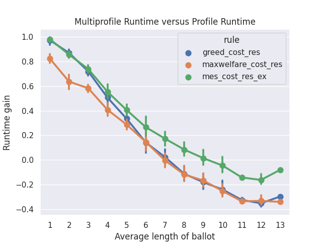
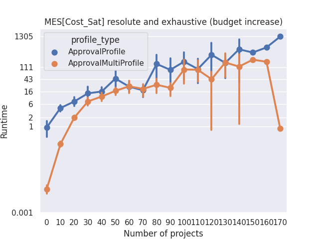

Complete Guide
==============

This guide offers a comprehensive explanation on using Pabutools. For a simpler tutorial,
refer to the :ref:`quickstart` page.

Instances
---------
Please refer to the module :py:mod:`~pabutools.election.instance` for more information.

A participatory budgeting instance encapsulates all the elements defining the elections. It includes
the projects up for voting, along with the budget limit.

The central class is :py:class:`~pabutools.election.instance.Instance`.
This class inherits from the Python `set` class, behaving as a set of projects,
augmented with additional information. Projects are instances of the class
:py:class:`~pabutools.election.instance.Project`, which stores a project's name, cost,
and any potential additional information. Here's an example:

.. code-block:: python

    from pabutools.election import Instance, Project

    instance = Instance()   # It accepts several optional parameters
    p1 = Project("p1", 1)   # The constructor requires the name and cost of the project
    instance.add(p1)   ## Set methods are used to add/remove projects from an instance
    p2 = Project("p2", 1)
    instance.add(p2)
    p3 = Project("p3", 3)
    instance.add(p3)

Notably, any Python comparison between two projects (equality, etc.) is based on the
name of the projects. Since an instance is a set, adding a project `Project("p", 1)` and
another project `Project("p", 3)` will result in an instance with a single project.

An instance also stores additional information such as the budget limit of the election
and additional metadata.

.. code-block:: python

    instance.budget_limit = 3   # The budget limit
    instance.meta   # dict storing metadata on the instance
    instance.project_meta   # dict of (project, dict) storing metadata on the projects

An instance can invoke several methods to iterate through all the budget allocations,
test the feasibility of a set of projects, and so on.

.. code-block:: python

    for b in instance.budget_allocations():
        print(str(b) + " is a feasible budget allocation")
    instance.is_feasible([p1, p2, p3])   # Returns False
    instance.is_exhaustive([p1, p2])   # Returns True

Profiles
--------

For reference, please refer to the modules :py:mod:`~pabutools.election.ballot` and
:py:mod:`~pabutools.election.profile`.

A profile is the second fundamental component of a participatory budgeting election; it stores
the ballots of the voters.

We provide a general class :py:class:`~pabutools.election.profile.profile.Profile`
that inherits from the Python class `list` and serves as a base for all specific
profile types. It primarily acts as an abstract class and should not be used
for any other purpose than inheritance. Similarly, we provide a class
:py:class:`~pabutools.election.ballot.ballot.Ballot` that is used as a base for specific
ballot formats.

A profile is associated with an instance, which is passed as a parameter and then stored in
an attribute. It also implements validation of the ballots to ensure the consistency
of the ballots in a profile.

.. code-block:: python

    from pabutools.election import Instance, Profile, Ballot

    instance = Instance()
    profile = Profile(instance=instance)
    profile.ballot_validation = True   # Boolean to activate/deactivate the validation of the ballot type
    profile.ballot_type = Ballot   # The type used for the ballot validation
    b = {1, 2, 3}
    profile.validate_ballot(b)   # The validator, would raise a TypeError here

Approval Profiles
^^^^^^^^^^^^^^^^^
When submitting approval ballots, voters submit a set of projects they approve of.
Approval ballots are represented through the class
:py:class:`~pabutools.election.ballot.approvalballot.ApprovalBallot` that inherits
from both `set` and :py:class:`~pabutools.election.ballot.ballot.Ballot`.

A profile of approval ballots, i.e., an approval profile, is instantiated from the class
:py:class:`~pabutools.election.profile.approvalprofile.ApprovalProfile`. It inherits from
:py:class:`~pabutools.election.profile.profile.Profile`. By default, it sets the type for the ballot
validator to :py:class:`~pabutools.election.ballot.approvalballot.ApprovalBallot`.

.. code-block:: python

    from pabutools.election import Project, ApprovalBallot, ApprovalProfile

    p = [Project("p{}".format(i), 1) for i in range(10)]
    b1 = ApprovalBallot(p[:3])   # Approval ballot containing the first 3 projects
    b1.add(p[4])   # Add project to approval ballot
    b2 = ApprovalBallot(p[1:5])
    profile = ApprovalProfile([b1, b2])
    b3 = ApprovalBallot({p[0], p[8]})
    profile.append(b3)
    b1 in profile   # Tests membership, returns True here

The :py:class:`~pabutools.election.profile.approvalprofile.ApprovalProfile` class provides several additional methods.

.. code-block:: python

    profile.approval_score(p1)   # The approval score of a project, i.e., the number of approvers
    profile.is_party_list()   # Boolean indicating if the profile is a party list profile

Cardinal Profiles
^^^^^^^^^^^^^^^^^

When required to submit cardinal ballots, voters are asked to assign a score to each project.
Cardinal ballots are represented using the class
:py:class:`~pabutools.election.ballot.cardinalballot.CardinalBallot`.
It directly inherits from the Python `dict` class and our
:py:class:`~pabutools.election.ballot.ballot.Ballot` class.

A profile of cardinal ballots, i.e., a cardinal profile, is created using the
:py:class:`~pabutools.election.profile.cardinalprofile.CardinalProfile` class.
It inherits from the :py:class:`~pabutools.election.profile.profile.Profile` class and validates ballot types using
:py:class:`~pabutools.election.ballot.cardinalballot.CardinalBallot`.

.. code-block:: python

    from pabutools.election import Project, CardinalBallot, CardinalProfile

    p = [Project("p{}".format(i), 1) for i in range(10)]
    b1 = CardinalBallot({p[1]: 5, p[2]: 0})   # Cardinal ballot scoring 5 for p1 and 0 for p2
    b1.append(p[1])   # The ballot becomes p0 > p4 > p2 > p1
    profile = CardinalProfile()
    profile.append(b1)

Cumulative Profiles
^^^^^^^^^^^^^^^^^^^

Cumulative ballots correspond to a specific type of cardinal ballots where the voters are
allocated a specific number of points that they can distribute among the projects.
The class :py:class:`~pabutools.election.ballot.cumulativeballot.CumulativeBallot`
is used to handle cumulative ballots. It inherits from
:py:class:`~pabutools.election.ballot.cardinalballot.CardinalBallot` and thus also from
the Python class `dict`.

As before, a profile of cumulative ballots is defined in the class
:py:class:`~pabutools.election.profile.cumulativeprofile.CumulativeProfile`
that inherits from the :py:class:`~pabutools.election.profile.profile.Profile` class
(and acts thus as a `list`).

Ordinal Profiles
^^^^^^^^^^^^^^^^

When ordinal ballots are used, voters are asked to rank the projects based on their
preferences. The class :py:class:`~pabutools.election.ballot.ordinalballot.OrdinalBallot`
represents such ballots. It inherits from the Python class `list` (actually the class
`dict` to ensure unicity of the projects, but all `list` methods have been implemented)
and our class :py:class:`~pabutools.election.ballot.ballot.Ballot`.

Ordinal profiles are handled by the class
:py:class:`~pabutools.election.profile.ordinalprofile.OrdinalProfile`.

.. code-block:: python

    from pabutools.election import Project, OrdinalBallot, OrdinalProfile

    p = [Project("p{}".format(i), 1) for i in range(10)]
    b1 = OrdinalBallot((p[0], p[4], p[2]))   # Ordinal ballot ranking p0 > p4 > p2
    b1.append(p[1])   # The ballot becomes p0 > p4 > p2 > p1
    profile = OrdinalProfile()
    profile.append(b1)

Multiprofile
-------------

For reference, see the modules :py:mod:`~pabutools.election.profile`.

In some cases, it is faster to use multisets instead of lists for the profiles. We have
implemented this through multiprofiles. A multiprofile is a collection of ballots where
each ballot is stored once, along with its multiplicity.

Multiprofiles are defined through the class
:py:class:`~pabutools.election.profile.profile.MultiProfile` that inherits from the Python
class `Counter`. Each specific type of profile has its multiprofile counterpart:
:py:class:`~pabutools.election.profile.approvalprofile.ApprovalMultiProfile`,
:py:class:`~pabutools.election.profile.cardinalprofile.CardinalMultiProfile`,
:py:class:`~pabutools.election.profile.cumulativeprofile.CumulativeMultiProfile`,
and :py:class:`~pabutools.election.profile.ordinalprofile.OrdinalMultiProfile`.
Importantly, our implementations allow for profiles and multiprofiles to be used
interchangeably (for rules, analysis, etc.).

Since ballots are used as dictionary keys in a multiprofile, they have to be immutable.
We have thus implemented the class :py:class:`~pabutools.election.ballot.ballot.FrozenBallot`
which corresponds to the immutable representation of a ballot. All specific ballot types
have their frozen counterparts:
:py:class:`~pabutools.election.ballot.approvalballot.FrozenApprovalBallot`,
:py:class:`~pabutools.election.ballot.cardinalballot.FrozenCardinalBallot`,
:py:class:`~pabutools.election.ballot.cumulativeballot.FrozenCumulativeBallot`,
and :py:class:`~pabutools.election.ballot.ordinalballot.FrozenOrdinalBallot`.

Ballots can easily be frozen:

.. code-block:: python

    from pabutools.election import Project, ApprovalBallot, FrozenApprovalBallot

    app_ballot = ApprovalBallot({Project("p1", 1), Project("p2", 2)})
    # Freezing a ballot using the frozen method of a ballot
    frozen_ballot = app_ballot.frozen()

    # Freezing a ballot using the frozen ballot constructor
    frozen_ballot = FrozenApprovalBallot(app_ballot)

Similarly profiles can easily be turned into multiprofiles:

.. code-block:: python

    from pabutools.election import Project, ApprovalBallot, FrozenApprovalBallot
    from pabutools.election import ApprovalProfile, ApprovalMultiProfile

    b1 = ApprovalBallot({Project("p1", 1), Project("p2", 2)})
    b2 = ApprovalBallot({Project("p1", 1), Project("p3", 2)})
    profile = ApprovalProfile([b1, b2])

    # Multiprofile from the method of a profile
    multiprofile = profile.as_multiprofile()

    # Multiprofile using the constructor
    frozen_ballot = ApprovalMultiProfile(profile=profile)

What is the gain of multiprofiles, you would ask? Well, we can show that using multiprofile
speeds up the computation as long as voters do not approve of more than 7 projects on average.

For the above plot, we computed the outcome of the rules on the data hosted on
`pabulib <http://pabulib.org>`_ both when using profiles and multiprofiles. We measured the
runtime and plotted the following measure:

.. code-block:: shell

    (multiprofile_runtime - profile_runtime) / max(multiprofile_runtime, profile_runtime)

To get more insights, we also plot the actual runtime for each type of profiles:

(Note the log scale above)

Preference Libraries
--------------------

See :ref:`preflibraries` for a reference.

We provide support for standard preference libraries.

PaBuLib
^^^^^^^

Full support is provided for the participatory budgeting data hosted on the
`pabulib <http://pabulib.org>`_ website. You can use the function
:py:func:`~pabutools.election.pabulib.parse_pabulib` to parse a file
that conforms to the pabulib format. This function yields the instance
and profile based on the appropriate profile class determined by the ballot
format in the data.

.. code-block:: python

    from pabutools.election import parse_pabulib

    instance, profile = parse_pabulib("path_to_the_file")

Pabulib files contain an extensive range of metadata. This metadata is
stored in the `meta` members of the instance and profile classes.

.. code-block:: python

    from pabutools.election import parse_pabulib

    instance, profile = parse_pabulib("path_to_the_file")
    instance.meta   # The meta dict is populated with all the metadata described in the file
    instance.project_meta    # The project_meta dict is populated with the metadata related to the projects
    for ballot in profile:
        ballot.meta    # The meta dict populated with the metadata corresponding to the ballot

Several metadata is housed as members of the corresponding
classes. For example, all known constraints
that the voters were subjected to when submitting their ballots. This includes the minimum
length of a ballot or the number of points that must be allocated for instance.

.. code-block:: python

    ### For ApprovalProfile, CardinalProfile, CumulativeProfile, and OrdinalProfile
    profile.legal_min_length   # Imposed minimum length of the ballots in the profile
    profile.legal_max_length   # Imposed maximum length of the ballots in the profile

    ### For ApprovalProfile only
    profile.legal_min_cost   # Imposed minimum total cost of the ballots in the profile
    profile.legal_max_cost   # Imposed maximum total cost of the ballots in the profile

    ### For CardinalProfile and CumulativeProfile
    profile.legal_min_score   # Imposed minimum score assigned to a project for the ballots in the profile
    profile.legal_max_score   # Imposed maximum score assigned to a project for the ballots in the profile

    ### For CumulativeProfile only
    profile.legal_min_total_score   # Imposed minimum total scores for the ballots in the profile
    profile.legal_max_total_score   # Imposed maximum total scores for the ballots in the profile

PrefLib
^^^^^^^

In addition to `pabulib <http://pabulib.org>`_ , our package also supports the
`preflib <https://preflib.org>`_  format, providing functions to convert a participatory
budgeting election into a PrefLib instance.

.. code-block:: python

    from pabutools.election import Instance, ApprovalProfile, CardinalProfile, OrdinalProfile
    from pabutools.election import approval_to_preflib, cardinal_to_preflib, ordinal_to_preflib

    instance = Instance()

    # Approval profiles are mapped to categorical instances for PrefLib
    app_profile = ApprovalProfile()
    preflib_instance = approval_to_preflib(instance, app_profile)

    # Cardinal profiles are mapped to ordinal instances for PrefLib
    card_profile = CardinalProfile()
    preflib_instance = cardinal_to_preflib(instance, card_profile)

    # Ordinal profiles are mapped to ordinal instances for PrefLib
    ord_profile = ApprovalProfile()
    preflib_instance = ordinal_to_preflib(instance, ord_profile)

Satisfaction Measures
---------------------

In participatory budgeting, various concepts and rules utilize proxies for voter satisfaction,
which are deduced from the submitted ballots rather than using the ballots directly.

We offer a range of satisfaction functions and provide flexible ways to create custom ones.
A satisfaction function is represented by a class that inherits from
:py:class:`~pabutools.election.satisfaction.satisfactionmeasure.SatisfactionMeasure`.
Such a class is initialized with specific parameters: an instance, a profile, and a ballot.
The class implements a `sat` method used to compute the satisfaction value for that
particular ballot. Additionally, we introduce
:py:class:`~pabutools.election.satisfaction.satisfactionprofile.SatisfactionProfile`,
a class that inherits from the Python class `list` and facilitates managing a collection
of satisfaction functions. We also have
:py:class:`~pabutools.election.satisfaction.satisfactionprofile.SatisfactionMultiProfile`,
which represents satisfaction profiles as multisets (see our discussion above about multiprofiles).

The typical workflow involves gathering the ballots into a profile, converting them
into a collection of satisfaction functions, and then using these functions as input to a rule.

.. code-block:: python

    from pabutools.election import SatisfactionProfile, SatisfactionMeasure
    from pabutools.election import parse_pabulib

    instance, profile = parse_pabulib("path_to_the_file")
    sat_profile = SatisfactionProfile(instance=instance)

    # We define a satisfaction function:
    class MySatisfaction(SatisfactionMeasure):
        def sat(self, projects):
            return 100 if "p1" in projects else len(projects)

    # We populate the satisfaction profile
    for ballot in profile:
        sat_profile.append(MySatisfaction(instance, profile, ballot))

    # The satisfaction profile is ready for use
    outcome = rule(sat_profile)

To simplify the process of defining the satisfaction profile, we offer convenient
methods and provide several widely used satisfaction functions.

.. code-block:: python

    from pabutools.election import SatisfactionProfile, Cardinality_Sat
    from pabutools.election import parse_pabulib

    instance, profile = parse_pabulib("path_to_the_file")
    # If a profile and a sat_class are given to the constructor, the satisfaction profile
    # is directly initialized with one instance of the sat_class per ballot in the profile.
    sat_profile = SatisfactionProfile(instance=instance, profile=profile, sat_class=Cardinality_Sat)
    # The satisfaction profile is ready for use
    outcome = rule(sat_profile)

Next, we present additional tools we provide to define satisfaction functions.

Functional Satisfaction Functions
^^^^^^^^^^^^^^^^^^^^^^^^^^^^^^^^^

For more specific ways of defining satisfaction functions, we introduce the class
:py:class:`~pabutools.election.satisfaction.functionalsatisfaction.FunctionalSatisfaction`.
This class corresponds to a satisfaction function defined by a function that takes as arguments
an instance, a profile, a ballot, and a set of projects. To demonstrate its use, we illustrate
how to define the Chamberlin-Courant satisfaction function with approval (equal to 1 if
at least one approved project is selected and 0 otherwise).

.. code-block:: python

    from pabutools.election import FunctionalSatisfaction

    def cc_sat_func(instance, profile, ballot, projects):
        return int(any(p in ballot for p in projects))

    class CC_Sat(FunctionalSatisfaction):
            def __init__(self, instance, profile, ballot):
                super(CC_Sat, self).__init__(instance, profile, ballot, cc_sat_func)

Additive Satisfaction Functions
^^^^^^^^^^^^^^^^^^^^^^^^^^^^^^^

We also offer additive satisfaction functions, where the satisfaction for a set
of projects is equal to the sum of the satisfaction of each individual project. The class
:py:class:`~pabutools.election.satisfaction.additivesatisfaction.AdditiveSatisfaction`
implements such functions. Its constructor takes a function as a parameter that maps
instance, profile, ballot, project, and pre-computed values to a score. The pre-computed
argument is used to pass fixed parameters to the function that can be used
for expensive computations not to be done more than once. As an example, we demonstrate
how to define the cardinality satisfaction function.

.. code-block:: python

    from pabutools.election import AdditiveSatisfaction

    def cardinality_sat_func(instance, profile, ballot, project, precomputed_values):
        return int(project in ballot)

    class Cardinality_Sat(AdditiveSatisfaction):
        def __init__(self, instance, profile, ballot):
            super(Cardinality_Sat, self).__init__(instance, profile, ballot, cardinality_sat_func)

Positional Satisfaction Functions
^^^^^^^^^^^^^^^^^^^^^^^^^^^^^^^^^

For ordinal ballots, we have positional satisfaction functions, where a voter's
satisfaction depends on the position of projects in their ballot. The class
:py:class:`~pabutools.election.satisfaction.positionalsatisfaction.PositionalSatisfaction`
implements these functions. Its constructor takes two functions as parameters: one that maps
ballots and projects to a score and another that aggregates the individual scores for sets
of projects. As an example, we define the additive Borda satisfaction function.

.. code-block:: python

    from pabutools.election import PositionalSatisfaction

    def borda_sat_func(ballot, project):
        if project not in ballot:
            return 0
        return len(ballot) - ballot.index(project)

    class Additive_Borda_Sat(PositionalSatisfaction):
        def __init__(self, instance, profile, ballot):
            super(Additive_Borda_Sat, self).__init__(instance, profile, ballot, borda_sat_func, sum)

Satisfaction Functions Already Defined
^^^^^^^^^^^^^^^^^^^^^^^^^^^^^^^^^^^^^^

Several satisfaction functions are already defined in the package and can be imported
from `pabutools.election`. We list them below.

- :py:class:`~pabutools.election.satisfaction.functionalsatisfaction.CC_Sat` implements the Chamberlin-Courant satisfaction function.
- :py:class:`~pabutools.election.satisfaction.functionalsatisfaction.Cost_Sqrt_Sat` defines the satisfaction as the square root of the total cost of the selected and approved projects.
- :py:class:`~pabutools.election.satisfaction.functionalsatisfaction.Cost_Log_Sat` defines the satisfaction as the log of the total cost of the approved and selected projects.
- :py:class:`~pabutools.election.satisfaction.additivesatisfaction.Cardinality_Sat` defines the satisfaction as the number of approved and selected projects.
- :py:class:`~pabutools.election.satisfaction.additivesatisfaction.Relative_Cardinality_Sat` defines the satisfaction as the number of approved and selected projects divided by the size the largest feasible subset of the ballot.
- :py:class:`~pabutools.election.satisfaction.additivesatisfaction.Cost_Sat` defines the satisfaction as the total cost of the approved and selected projects.
- :py:class:`~pabutools.election.satisfaction.additivesatisfaction.Relative_Cost_Sat` defines the satisfaction as the total cost of the approved and selected projects divided by the total cost of the most expensive subset of the ballot.
- :py:class:`~pabutools.election.satisfaction.additivesatisfaction.Relative_Cost_Approx_Normaliser_Sat` resembles the previous but uses the total cost of the ballot as the normalizer.
- :py:class:`~pabutools.election.satisfaction.additivesatisfaction.Effort_Sat` defines the satisfaction as the total share of a voter, i.e., the sum over all approved and selected projects of the cost divided by the approval score.
- :py:class:`~pabutools.election.satisfaction.additivesatisfaction.Additive_Cardinal_Sat` defines the satisfaction as the sum of the scores of the selected projects, where the scores are taken from the cardinal ballot of the voter.
- :py:class:`~pabutools.election.satisfaction.positionalsatisfaction.Additive_Borda_Sat` defines the satisfaction as the sum of the Borda scores of the selected projects.

Rules
-----

For reference, see the module :py:mod:`~pabutools.rules`.

We provide the implementation of the most celebrated rules for participatory budgeting.

Additive Utilitarian Welfare Maximiser
^^^^^^^^^^^^^^^^^^^^^^^^^^^^^^^^^^^^^^

The first rule provided is the Additive Utilitarian Welfare Maximiser. It aims to return
budget allocations that maximize the utilitarian social welfare when the satisfaction
measure is additive.

.. code-block:: python

    from pabutools.election import Instance, Project, ApprovalProfile, ApprovalBallot, Cost_Sat
    from pabutools.rules import max_additive_utilitarian_welfare

    p = [Project("p" + str(i), 1) for i in range(10)]
    instance = Instance(p, budget_limit=5)
    profile = ApprovalProfile([
        ApprovalBallot(p),
        ApprovalBallot(p[:4]),
        ApprovalBallot({p[0], p[8]})
    ])

    # By passing a sat_class, the profile is automatically converted to a satisfaction profile
    outcome = max_additive_utilitarian_welfare(
        instance,
        profile,
        sat_class=Cost_Sat
    )

    # Or we can directly pass the satisfaction profile
    outcome = max_additive_utilitarian_welfare(
        instance,
        profile,
        sat_profile=profile.as_sat_profile(Cost_Sat)
    )

    # An initial budget allocation can be given
    outcome = max_additive_utilitarian_welfare(
        instance,
        profile,
        sat_profile=profile.as_sat_profile(Cost_Sat),
        initial_budget_allocation=[p[1], p[2]]
    )

    # We can get the irresolute outcome, i.e., a set of tied budget allocations
    irresolute_outcome = max_additive_utilitarian_welfare(
        instance,
        profile,
        sat_class=Cost_Sat,
        resoluteness=False
    )

The outcome of the utilitarian welfare maximiser is computed using a linear program solver
(through the  `mip package <https://www.python-mip.com/>`_). Irresolute outcomes are
computed by iteratively adding constraints excluding previously returned budget
allocations. Note that because the computation is handled via a linear program solver, we
have no control as to how ties are broken. Moreover, there are no clear ways to adapt this
for non-additive satisfaction measures.

Greedy Approximation of the Welfare Maximiser
^^^^^^^^^^^^^^^^^^^^^^^^^^^^^^^^^^^^^^^^^^^^^

The library also implements standard greedy rules. The primary rule used in this
context is the Greedy Utilitarian Welfare. It behaves similarly to the
Utilitarian Welfare Maximiser but offers additional functionalities: it is not limited
to additive satisfaction measures (and runs faster).

.. code-block:: python

    from pabutools.election import Instance, Project, ApprovalProfile, ApprovalBallot, Cost_Sat
    from pabutools.rules import greedy_utilitarian_welfare
    from pabutools.tiebreaking import app_score_tie_breaking

    p = [Project("p" + str(i), 1) for i in range(10)]
    instance = Instance(p, budget_limit=5)
    profile = ApprovalProfile([
        ApprovalBallot(p),
        ApprovalBallot(p[:4]),
        ApprovalBallot({p[0], p[8]})
    ])

    # By passing a sat_class, the profile is automatically converted to a satisfaction profile
    outcome = greedy_utilitarian_welfare(
        instance,
        profile,
        sat_class=Cost_Sat
    )

    # Or we can directly pass the satisfaction profile
    outcome = greedy_utilitarian_welfare(
        instance,
        profile,
        sat_profile=profile.as_sat_profile(Cost_Sat)
    )

    # If the satisfaction is known to be additive, we can say so to speed up computations
    # This is highly recommended
    outcome = greedy_utilitarian_welfare(
        instance,
        profile,
        sat_profile=profile.as_sat_profile(Cost_Sat),
        is_sat_additive=True
    )

    # An initial budget allocation can be given
    outcome = greedy_utilitarian_welfare(
        instance,
        profile,
        sat_profile=profile.as_sat_profile(Cost_Sat),
        initial_budget_allocation=[p[1], p[2]]
    )

    # The tie-breaking rule can be decided
    outcome = greedy_utilitarian_welfare(
        instance,
        profile,
        sat_profile=profile.as_sat_profile(Cost_Sat),
        tie_breaking=app_score_tie_breaking
    )

    # We can get the irresolute outcome, i.e., a set of tied budget allocations
    irresolute_outcome = greedy_utilitarian_welfare(
        instance,
        profile,
        sat_class=Cost_Sat,
        resoluteness=False
    )

Sequential Phragmén's Rule
^^^^^^^^^^^^^^^^^^^^^^^^^^

Another rule provided is the Sequential Phragmén's Rule, which is different from the
previous two as it does not rely on a satisfaction measure.

.. code-block:: python

    from pabutools.election import Instance, Project, ApprovalProfile, ApprovalBallot, Cost_Sat
    from pabutools.rules import sequential_phragmen
    from pabutools.tiebreaking import app_score_tie_breaking

    p = [Project("p" + str(i), 1) for i in range(10)]
    instance = Instance(p, budget_limit=5)
    profile = ApprovalProfile([
        ApprovalBallot(p),
        ApprovalBallot(p[:4]),
        ApprovalBallot({p[0], p[8]})
    ])

    # By passing a sat_class, the profile is automatically converted to a satisfaction profile
    outcome = sequential_phragmen(
        instance,
        profile
    )

    # An initial budget allocation can be given
    outcome = sequential_phragmen(
        instance,
        profile,
        initial_budget_allocation=[p[1], p[2]]
    )

    # The tie-breaking rule can be decided
    outcome = sequential_phragmen(
        instance,
        profile,
        tie_breaking=app_score_tie_breaking
    )

    # We can get the irresolute outcome, i.e., a set of tied budget allocations
    irresolute_outcome = sequential_phragmen(
        instance,
        profile,
        resoluteness=False
    )

Method of Equal Shares (MES)
^^^^^^^^^^^^^^^^^^^^^^^^^^^^

The Method of Equal Shares is another rule that returns budget allocations based on the satisfaction
measure provided. For more details, see the `equalshares.net <https://equalshares.net/>`_ website.

.. code-block:: python

    from pabutools.election import Instance, Project, ApprovalProfile, ApprovalBallot, Cost_Sat
    from pabutools.rules import method_of_equal_shares
    from pabutools.tiebreaking import app_score_tie_breaking

    p = [Project("p" + str(i), 1) for i in range(10)]
    instance = Instance(p, budget_limit=5)
    profile = ApprovalProfile([
        ApprovalBallot(p),
        ApprovalBallot(p[:4]),
        ApprovalBallot({p[0], p[8]})
    ])

    # By passing a sat_class, the profile is automatically converted to a satisfaction profile
    outcome = method_of_equal_shares(
        instance,
        profile,
        sat_class=Cost_Sat
    )

    # Or we can directly pass the satisfaction profile
    outcome = method_of_equal_shares(
        instance,
        profile,
        sat_profile=profile.as_sat_profile(Cost_Sat)
    )

    # An initial budget allocation can be given
    outcome = method_of_equal_shares(
        instance,
        profile,
        sat_profile=profile.as_sat_profile(Cost_Sat),
        initial_budget_allocation=[p[1], p[2]]
    )

    # The tie-breaking rule can be decided
    outcome = method_of_equal_shares(
        instance,
        profile,
        sat_profile=profile.as_sat_profile(Cost_Sat),
        tie_breaking=app_score_tie_breaking
    )

    # We can get the irresolute outcome, i.e., a set of tied budget allocations
    irresolute_outcome = method_of_equal_shares(
        instance,
        profile,
        sat_class=Cost_Sat,
        resoluteness=False
    )

MES can significantly under-use the budget. The idea of running the rule for different
initial budget for the voters has been proposed in the scientific literature as a fix
for that problem. The next section will present general methods to do so. For optimal
performances, one should use the following:

.. code-block:: python

    outcome = method_of_equal_shares(
        instance,
        profile.as_multiprofile(), # Faster in general (typically if ballots repeat each others)
        sat_class=Cost_Sat,
        voter_budget_increment=1 # As soon as not-None, mes iterated is used
    )

Exhaustion Methods
^^^^^^^^^^^^^^^^^^

Since not all rules return exhaustive budget allocations, the library offers standard
methods to render their outcome exhaustive.

Two methods are provided: the first applies a sequence of rules until achieving an
exhaustive budget allocation.

.. code-block:: python

    from pabutools.election import Instance, Project, ApprovalProfile, ApprovalBallot
    from pabutools.election import Cost_Sat, Cardinality_Sat
    from pabutools.rules import greedy_utilitarian_welfare, method_of_equal_shares
    from pabutools.rules import completion_by_rule_combination

    p = [Project("p" + str(i), 1) for i in range(10)]
    instance = Instance(p, budget_limit=5)
    profile = ApprovalProfile([
        ApprovalBallot(p),
        ApprovalBallot(p[:4]),
        ApprovalBallot({p[0], p[8]})
    ])

    # Here we apply two rules: first MES with the cost satisfaction,
    # and then the greedy rule with the cardinality satisfaction
    budget_allocation_mes_completed = completion_by_rule_combination(
        instance,
        profile,
        [method_of_equal_shares, greedy_utilitarian_welfare],
        [{"sat_class": Cost_Sat}, {"sat_class": Cardinality_Sat}],
    )

The second method consists of increasing the budget limit of the instance, in the hope that the
rule would then return a budget allocation that is exhaustive for the original instance. If at any
point the rule returns a budget allocation that is not feasible for the original budget limit, then
the previously returned budget allocation is returned.

.. code-block:: python

    from pabutools.election import Instance, Project, ApprovalProfile, ApprovalBallot, Cost_Sat
    from pabutools.rules import method_of_equal_shares, exhaustion_by_budget_increase
    from pabutools.fractions import frac

    p = [Project("p" + str(i), 1) for i in range(10)]
    instance = Instance(p, budget_limit=5)
    profile = ApprovalProfile([
        ApprovalBallot(p),
        ApprovalBallot(p[:4]),
        ApprovalBallot({p[0], p[8]})
    ])

    # Here we apply the MES rule with cost satisfaction until finding a suitable outcome
    budget_allocation_mes_iterated = exhaustion_by_budget_increase(
        instance,
        profile,
        method_of_equal_shares,
        {"sat_class": Cost_Sat},
        budget_step=instance.budget_limit * frac(1, 100), # Important for runtime, default is 1
    )

Note that since these two functions behave as rules, they can be combined. For instance, one
can first run MES with an increasing budget, and then complete the outcome with the greedy
method (which only does something if the outcome is not already exhaustive).

.. code-block:: python

    completion_by_rule_combination(
        instance,
        profile,
        [exhaustion_by_budget_increase, greedy_utilitarian_welfare],
        [
            {
                "rule": method_of_equal_shares,
                "rule_params": {"sat_class": Cost_Sat},
            },
            {"sat_class": Cost_Sat},
        ],
    )

Remember that for MES specifically, it is much faster to use the `voter_budget_increment`
parameter directly to obtain the iterated version.

Rule Composition
^^^^^^^^^^^^^^^^

The library also provides ways to compose rules, such as selecting the outcome that is
preferred by the largest number of voters for a given satisfaction measure.

.. code-block:: python

    from pabutools.election import Instance, Project, ApprovalProfile, ApprovalBallot
    from pabutools.election import Cost_Sat, Cardinality_Sat
    from pabutools.rules import greedy_utilitarian_welfare, method_of_equal_shares
    from pabutools.rules import popularity_comparison

    p = [Project("p" + str(i), 1) for i in range(10)]
    instance = Instance(p, budget_limit=5)
    profile = ApprovalProfile([
        ApprovalBallot(p),
        ApprovalBallot(p[:4]),
        ApprovalBallot({p[0], p[8]})
    ])

    # Here we apply two rules: MES and greedy with the cost satisfaction,
    # and return the most preferred outcome based on Cardinality_Sat
    outcome = popularity_comparison(
        instance,
        profile,
        Cardinality_Sat,
        [method_of_equal_shares, greedy_utilitarian_welfare],
        [{"sat_class": Cost_Sat}, {"sat_class": Cost_Sat}],
    )

To run the rule as it was implemented in Wieliczka and Świece, for instance, one would run
the following:

.. code-block:: python

    from pabutools.election import Instance, Project, ApprovalProfile, ApprovalBallot
    from pabutools.election import Cost_Sat, Cardinality_Sat
    from pabutools.rules import greedy_utilitarian_welfare, method_of_equal_shares
    from pabutools.rules import completion_by_rule_combination, popularity_comparison

    p = [Project("p" + str(i), 1) for i in range(10)]
    instance = Instance(p, budget_limit=5)
    profile = ApprovalProfile([
        ApprovalBallot(p),
        ApprovalBallot(p[:4]),
        ApprovalBallot({p[0], p[8]})
    ])

    # First define MES iterated and completed (to simplify)
    def mes_full(instance, profile, initial_budget_allocation=None):
        return completion_by_rule_combination(
            instance,
            profile,
            [method_of_equal_shares, greedy_utilitarian_welfare],
            [
                {
                    "sat_class": Cost_Sat,
                    "voter_budget_increment": 1,
                },
                {"sat_class": Cost_Sat},
            ],
        )

    # Then run a popularity comparison between MES in full and Greedy Cardinality
    popularity_comparison(
        instance,
        profile,
        Cardinality_Sat,
        [mes_full, greedy_utilitarian_welfare],
        [{}, {"sat_class": Cardinality_Sat}]
    )

We also provide a similar comparison using utilitarian social welfare through the function
:py:func:`~pabutools.rules.composition.social_welfare_comparison`.

Tie-Breaking
------------

For reference, see the module :py:mod:`~pabutools.tiebreaking`.

We provide several ways to break ties between several projects. All tie-breaking rules are
instantiations of the :py:class:`pabutools.tiebreaking.TieBreakingRule` class.
This class defines two functions `untie` and `order` that respectively return a single project
from a set of several or order a list of projects.

We profile several tie-breaking rules.

.. code-block:: python

    from pabutools.election import Project, Instance, ApprovalProfile, ApprovalBallot
    from pabutools.tiebreaking import max_cost_tie_breaking, min_cost_tie_breaking
    from pabutools.tiebreaking import app_score_tie_breaking, lexico_tie_breaking

    p = [Project("p0", 1), Project("p1", 2), Project("p2", 1)]
    instance = Instance(p, budget_limit=2)
    profile = ApprovalProfile([
        ApprovalBallot(p),
        ApprovalBallot(p[1:]),
        ApprovalBallot({p[1]})
    ])

    min_cost_tie_breaking.untie(instance, profile, [p[0], p[1]])   # Returns p0
    max_cost_tie_breaking.untie(instance, profile, [p[0], p[1]])   # Returns p1

    app_score_tie_breaking.untie(instance, profile, p)   # Returns p1
    app_score_tie_breaking.order(instance, profile, p)   # Returns [p1, p2, p0]

    lexico_tie_breaking.order(instance, profile, p)   # Returns [p0, p1, p2]

These are mainly used as arguments for the rules, as seen above.

Fractions
---------

For reference, see the module :py:mod:`~pabutools.fractions`.

We provide a customizable way to handle fractions. In general, all fractions should be defined
using the :py:func:`~pabutools.fractions.frac` function provided in the :py:mod:`~pabutools.fractions`
module. Not doing so may lead to undesirable behaviors (i.e., errors).

To make a fraction, simply follow this guide:

.. code-block:: python

    from pabutools.fractions import frac, str_as_frac

    # Define a fraction
    fraction = frac(1, 4)

    # Define a fraction from an integer
    fraction_from_int = frac(2)

    # Define a fraction from a float
    fraction_from_int = frac(2.6)

    # Define a fraction from a string
    fraction_from_str = str_as_frac("2.3")

By default, the `gmpy2 <https://gmpy2.readthedocs.io/en/latest/mpq.html>`_ module is used to
handle fractions. To change this, simply change the value of the `FRACTION` constant.

.. code-block:: python

    import pabutools.fractions

    # The default value
    pabutools.fractions.FRACTION = "gmpy2"

    # Change to Python float
    pabutools.fractions.FRACTION = "float"

Changing the `FRACTION` constant changes the algorithm used to handle fractions.

